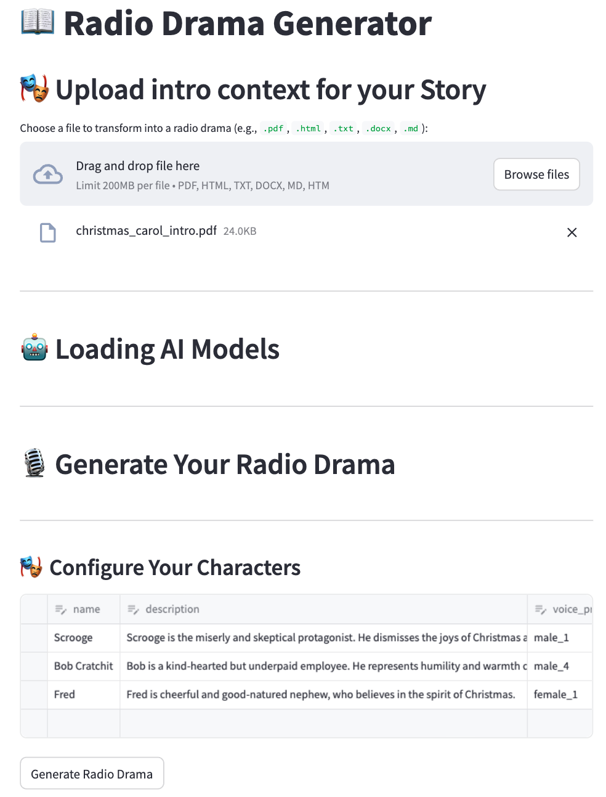

# 🎭 Radio Drama Generator

This Radio Drama Generator is a proof of concept for using open-source models & tools to convert input story context into a radio drama featuring multiple speakers.
It is designed to work on most local setups, meaning no external API calls or GPU access is required. This makes it more accessible and privacy-friendly by keeping everything local.


### Built with
- Python 3.10+ (use Python 3.12 for Apple M1/2/3 chips)
- [Llama-cpp](https://github.com/abetlen/llama-cpp-python) (text-to-text, i.e script generation)
- [OuteAI](https://github.com/edwko/OuteTTS) / [Parler_tts](https://github.com/huggingface/parler-tts) (text-to-speech, i.e audio generation)
- [Streamlit](https://streamlit.io/) (UI demo)


## Quick-start

Get started with Radio Drama Generator:

---

### Local Installation**

1. **Clone the Repository**
   Inside the Codespaces terminal, run:
   ```bash
   git clone https://github.com/stefanfrench/radio-drama-generator.git
   cd radio-drama-generator
   ```

2. **Install Dependencies**
   Inside the terminal, run:
   ```bash
   pip install -e .
3. **Run the Demo**
   Inside the terminal, start the Streamlit demo by running:
   ```bash
   python -m streamlit run demo/app.py
   ```

***NOTE***: The first time you run the demo app it might take a while to generate the script or the audio because it will download the models to the machine which are a few GBs in size.

<div style="margin-left: 40px;">
  
</div>


## How it Works


1. **Document Upload**
   Start by uploading a document in a supported format (e.g., PDF, .txt, or .docx).

2. **Document Pre-Processing**
   The uploaded document is processed to extract and clean the text. This involves:
   - Extracting readable text from the document.
   - Removing noise such as URLs, email addresses, and special characters to ensure the text is clean and structured.

3. **Script Generation**
   The cleaned text is passed to a language model to generate a radio drama in the form of a conversation between multiple speakers
   - **Model Loading**: The system selects and loads a pre-trained LLM optimized for running locally, using the llama_cpp library. This enables the model to run efficiently on CPUs, making them more accessible and suitable for local setups.
   - **Customizable Prompt**: A user-defined "system prompt" guides the LLM in shaping the conversation, specifying tone, content, speaker interaction, and format.
   - **Output Transcript**: The model generates a radio drama script in structured format, with each speaker's dialogue clearly labeled.
     Example output:
     ```json
     {"Speaker 1": "Bah, humbug! Why would I care for Christmas?",
      "Speaker 2": "If I may, sir, Christmas is about kindness, something we could all use more of.",
      "Speaker 3": "Uncle Scrooge, Christmas is a time for joy and goodwill!",
         ...
     }
     ```
   This step ensures that the radio drama script is engaging, relevant, and ready for audio conversion.

4. **Audio Generation**
  - The generated transcript is converted into audio using a Text-to-Speech (TTS) model.
  -	Each speaker is assigned a distinct voice.
	- The final output is saved as an audio file in formats like MP3 or WAV.

## Models

The architecture of this codebase focuses on modularity and adaptability, meaning it shouldn't be too difficult to swap frameworks to use your own suite of models. We have selected fully open source models that are very memory efficient and can run on a laptop CPU with less than 10GB RAM requirements.

### text-to-text

We are using the [llama.cpp](https://github.com/ggerganov/llama.cpp) library, which supports open source models optimized for local inference and minimal hardware requirements. The default text-to-text model in this repo is the open source [OLMoE-7B-Instruct](https://huggingface.co/allenai/OLMoE-1B-7B-0924-Instruct) from [AllenAI](https://allenai.org/).

For the complete list of models supported out-of-the-box, visit this [link](https://github.com/ggerganov/llama.cpp?tab=readme-ov-file#text-only).

### text-to-speech

We support models from the [OuteAI](https://github.com/edwko/OuteTTS) and [Parler_tts](https://github.com/huggingface/parler-tts) packages. The default text-to-speech model in this repo is [OuteTTS-0.1-350M-GGUF](https://huggingface.co/OuteAI/OuteTTS-0.1-350M-GGUF). Note that the `0.1-350M` version has a `CC-By-4.0` (permissive) license, whereas the newer / better `0.2-500M` version has a `CC-By-NC-4.0` (non-commercial) license.
For a complete list of models visit [Oute HF](https://huggingface.co/collections/OuteAI/outetts-6728aa71a53a076e4ba4817c) (only the GGUF versions) and [Parler HF](https://huggingface.co/collections/parler-tts/parler-tts-fully-open-source-high-quality-tts-66164ad285ba03e8ffde214c).

**Important note:** In order to keep the package dependencies as lightweight as possible, only the Oute interface is installed by default. If you want to use the parler models, please also run:

```bash
pip install -e '.[parler]'
```


## Pre-requisites

- **System requirements**:
  - OS: Windows, macOS, or Linux
  - Python 3.10>, <3.12
  - Minimum RAM: 10 GB
  - Disk space: 32 GB minimum

- **Dependencies**:
  - Dependencies listed in `pyproject.toml`

## Troubleshooting

> During the installation of the package, it fails with `ERROR: Failed building wheel for llama-cpp-python`

You are probably missing the `GNU Make` package. A quick way to solve it is run on your terminal `sudo apt install build-essential`

## License

This project is licensed under the Apache 2.0 License. See the [LICENSE](LICENSE) file for details.
